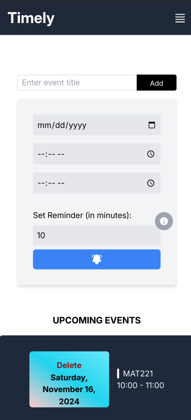
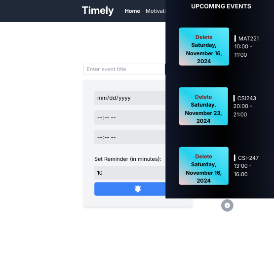
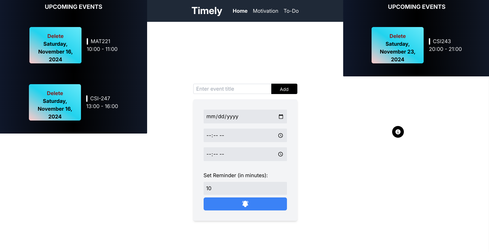

# Academic Manager (Timely) App
 

## Table of contents
1. [Project Overview](#project-overview)
2. [App Features and Functionalities](#features)
3. [Technology Stack](#technology-stack)
4. [Developement Workflow](development-workflow)
5. [API Usage and Intergration](#development-workflow)
6. [Challenges and Solutions](#challenges-faced)
7. [Future Improvements](#future-improvements)
8. [Testing and Deployment](#testing-and-deployment)
9. [Acknowledgements](#acknowledgment)

 

# Project Overview
 
Timley is a time-management and self-motivation tool designed for students and lecturers. It addresses the common challenges of disorganized schedules and missed events. The app acts as a digital assistant, offereing reminders for academic tasks and motivational support.

 

# Features
 

## Task Manger: ##
Create, edit and delete to-do lists. Mark tasks as completed for better tracking.

## Motivational Quotes: ##
Browse through uplifting quotes for inspiration.

## Event Planner: ##
Schedule events with customizable reminders.  
Push notifications ensure you never miss an event, whether online or offline.

 

# Technology Stack
  
### Frontend Framework: Angular 
### Styling: 
Tailwind CSS
### Storage: 
Local Storage with Bitoa encryption for data security.
### Navigation: 
User-friendly interface with three distinct pages.
### API's: ###
1. OneSignal for notifications.
2. Progressive Web App (PWA) capabilities for offline use.

### Deployment: Vercel for quick and seamless hosting ##

 

# Development Workflow
### Version Control: 
Github served as the backbone of the development process, ensuring seamless collaboration and version tracking.

### Local Resources:
Some assets were stored locally to optimize workflow

## Challenges Faced
 

### PWA Limitations
Limited offline notifications led to intergrating OneSignal

### Local Storage Contraints
Data is device-specific, lacking cross-device synchronization

### Date Formatting Issues
Managing various data formats caused initial errors but was resolved with robust parsing techniques.

### Clustered Events and less Restricted Working Space
Resolved this by introducing button to toggle when to show the upcoming events due to limited space on screen and introduding two way view of events(left and right)

 

# Future Improvements
### Filtering by Date
Streamline task and event by implementing date-based filters

### Backend Intergration
Enable cross-device data synchronization for a more seamless user experience.

### Theme Toggling
Introduce dark and light mode to suit different user preferences

### Parsing of PDF files
Facilitate eassness of event scheduling by permiting uploading of pdf files, extracting relavant data thereby reducing effort in typing

 

# Testing and Deployment
## Testing 
The app was rigorously tested across small, medium and large screen devices to ensure responsiveness
## Deployment
Hosted on Vercel for it's ease of use and scalability

 

# Acknowledgment
## We express gratitude to the following resources and communities:

### NetNinja
Tailwindcss and other learning resources.
### Pexels & Flaticon
For images and favicons
### Heroicons
Icons that enhanced UI.
### Github Contributors(Michele Riva && Matt Lewis)
JSON quotes and calender component
### OneSignal, Tailwind CSS and Angular Documentation
API integration and styling.
### StackOverflow and General Web Resources
For Debugging and insights.

 

# Final Thoughts

  **Timely** provides a holistic approach to academic management by combining productivity tools with motivational support. It's a robust solution for students and educators to efficiently manage their time and stay motivated.
